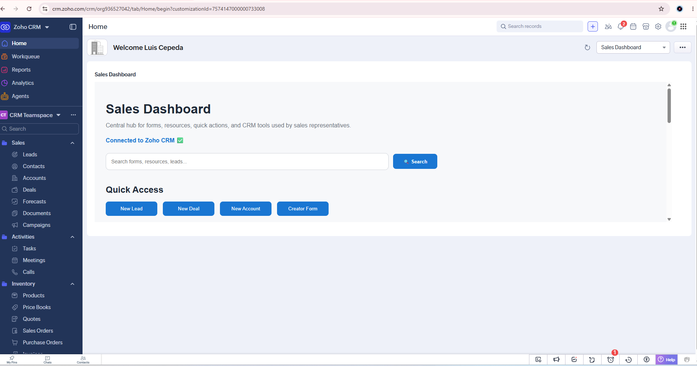
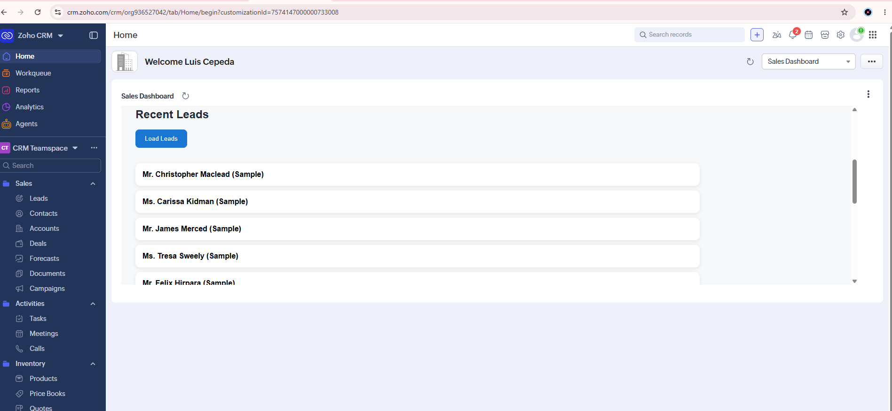
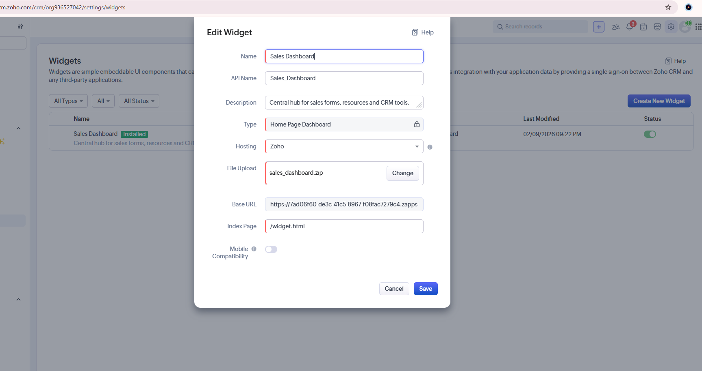

# Zoho Sales Dashboard

Custom dashboard widget built for Zoho CRM.

## Dashboard Home

## Lead Retrieval

## Widget installed

## Features

- Home Page Dashboard
- Search Bar
- Quick Access Section
- Sales Resources
- Zoho CRM Widget SDK Integration

## Technologies

- Zoho CRM
- Zoho Widget SDK
- HTML
- CSS
- JavaScript

## Roadmap

- [ ] CRM Lead Integration
- [ ] KPI Dashboard
- [ ] Zoho Creator Forms
- [ ] Advanced Search
- [ ] React Migration

## Current Status

✅ Widget created

✅ Published to Zoho CRM

✅ Home Page Dashboard configured

✅ GitHub repository created

🔄 Next Steps

- Retrieve CRM Leads using Widget SDK
- Build KPI section
- Integrate Zoho Creator forms
- Add dashboard search functionality

---

## Achievements

- Created a custom Zoho CRM widget
- Published a Home Page Dashboard
- Connected Zoho Widget SDK
- Retrieved CRM lead records through API
- Implemented custom dashboard UI

## Current Features

- Custom Home Page Dashboard for Zoho CRM
- Zoho CRM Widget SDK integration
- CRM connection status indicator
- KPI cards for Leads, Accounts, and Deals
- Quick actions to create Leads, Deals, and Accounts
- Recent Leads retrieval
- Recent Accounts retrieval
- Detailed Lead information:
  - Name
  - Company
  - Email
  - Phone
- Detailed Account information:
  - Account name
  - Phone
  - Website
- Dashboard search interface
- Keyboard support for search using Enter

## Current Status

The dashboard is successfully connected to Zoho CRM and can retrieve live CRM data through the Zoho CRM Widget SDK.

### Completed

- [x] Create and publish the Zoho CRM widget
- [x] Configure the widget as a Home Page Dashboard
- [x] Connect the Zoho CRM Widget SDK
- [x] Display recent Leads
- [x] Display recent Accounts
- [x] Add KPI cards
- [x] Add native CRM quick actions
- [x] Add Git and GitHub version control

### Next Steps

- [ ] Implement functional dashboard search
- [ ] Improve the responsive layout
- [ ] Add recent Deals
- [ ] Integrate the first Zoho Creator form
- [ ] Publish a full-screen Web Tab version
- [ ] Migrate the interface to React

## Author

Luis Garcia
